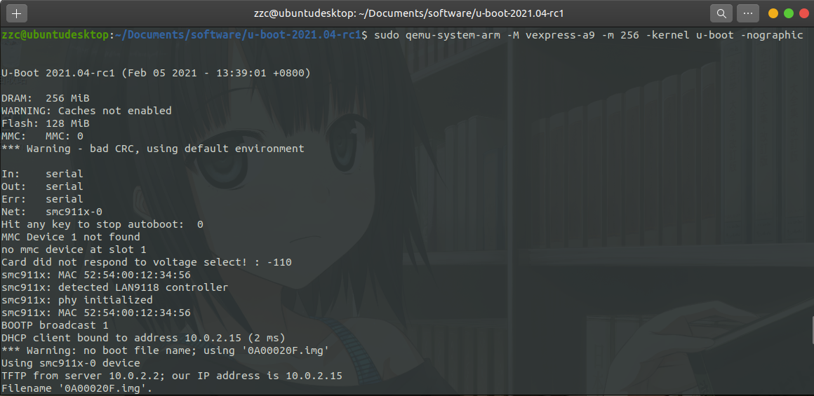

# QEMU 进行 Arm 仿真开发

[toc]

## 前言

## 什么是 QEMU

QEMU 是一套由法布里斯·贝拉(Fabrice Bellard)所编写的以GPL许可证分发源码的模拟处理器，在 GNU/Linux 平台上使用广泛。Bochs，PearPC 等与其类似，但不具备其许多特性，比如高速度及跨平台的特性，通过 KQEMU 这个闭源的加速器，QEMU 能模拟至接近真实电脑的速度。0.9.1 及之前版本的 qemu 可以使用 kqemu 加速器。在 qemu1.0 之后的版本，都无法使用 kqemu，主要利用 qemu-kvm 加速模块，并且加速效果以及稳定性明显比 kqemu 好。（摘自[百度百科](https://baike.baidu.com/item/QEMU/1311178)）


## 为什么要用 QEMU

因为**穷**，所以只能玩模拟器咯

主机平台 Ubuntu 20.04


## 安装 QEMU

### 包管理器安装

直接 apt 安装，模拟 Arm 就直接安装 qemu-system-arm 就行；也可以 ```sudo apt install qemu-system``` 安装全部模拟环境

```bash
sudo apt update && sudo apt install qemu-system-arm -y
```


### 源码安装

包管理器可以安装，为什么还要这么麻烦使用源码安装呢？这样更有逼格？当然不是，因为包管理器的版本可能会比较老。

**安装编译源码需要的环境**

```bash
sudo apt install build-essential pkg-config zlib1g-dev libglib2.0-0 \
libglib2.0-dev  libsdl1.2-dev libpixman-1-dev libfdt-dev autoconf \
automake libtool librbd-dev libaio-dev flex bison ninja-build
```

**下载源码**

<https://download.qemu.org/>

**编译安装**

```bash
tar xf qemu-5.2.0-rc4.tar.xz
cd qemu-5.2.0-rc4/
# --target-list选择目标机器的架构;默认是将所有的架构都编译;可通过./configure --help查看支持的架构
./configure --target-list=arm-softmmu
# 根据自己CPU选择合适的数字
make -j4 
sudo make install
```

测试安装是否成功

```bash
qemu-system-arm --version
# 成功输出
QEMU emulator version 5.1.94
Copyright (c) 2003-2020 Fabrice Bellard and the QEMU Project developers
```


## 安装交叉编译工具链

### 包管理器安装

```bash
sudo apt install gcc-arm-linux-gnueabihf
sudo apt install g++-arm-linux-gnueabihf
```


### linaro 安装

<https://releases.linaro.org/components/toolchain/binaries/>


## 编译 uboot 并仿真

### 下载源码

<https://ftp.denx.de/pub/u-boot/>


### 编译

查看编译配置

```bash
ls configs/
```

这里我们选择 vexpress_ca9x4_defconfig

```bash
make vexpress_ca9x4_defconfig
# 指定编译器为 arm-linux-gnueabihf-
make ARCH=arm CROSS_COMPILE=arm-linux-gnueabihf- -j4
```


### 仿真

```bash
qemu-system-arm -M vexpress-a9 -m 256 -kernel u-boot -nographic
```



按```Ctrl+Shift+a 后按 x ```退出 qemu


## 编译内核并仿真

**编译内核可以参考另一篇文章 [Linux_x86_64 内核编译](003_编译内核.md)**

### 下载源码

<https://www.kernel.org/>

我这里下载的是 5.10.7


### 编译

**解压**

```bash
tar xvf linux-5.10.7.tar.xz
cd linux-5.10.7/
```

**查看编译帮助**

```bash
make ARCH=arm help
```

**查看配置**

 编译帮助里面也可以看到配置

```bash
ls arch/arm/configs/
```


**配置**

```bash
make ARCH=arm vexpress_defconfig
# 可选，上一步执行之后一般默认就行
make ARCH=arm menuconfig
```


**编译**

```bash
make ARCH=arm CROSS_COMPILE=arm-linux-gnueabihf- -j4
````

编译完成


### 仿真

```bash
qemu-system-arm -M vexpress-a9 \
-m 256M \
-kernel arch/arm/boot/zImage \
-dtb arch/arm/boot/dts/vexpress-v2p-ca9.dtb \
-nographic
```

会停在加载文件系统那里


## busybox 制作rootfs 并仿真

### 下载源码

<https://busybox.net/>


### 编译

**配置**

```bash
make ARCH=arm defconfig
make ARCH=arm menuconfig
```

勾选 Settings -> Build static binary


**编译**

```bash
make ARCH=arm CROSS_COMPILE=arm-linux-gnueabihf- -j4
```


### 仿真

**制作镜像文件**

在 busybox 目录下建立如下 shell 文件

```bash
#!/bin/sh
tmpfs=/_tmpfs

# 如果存在删除
sudo rm -rf rootfs
sudo rm -rf ${tmpfs}
sudo rm -f rootfs.ext4

sudo mkdir rootfs
# 拷贝 _install 中文件 到 rootfs
sudo cp _install/*  rootfs/ -raf

cd rootfs && sudo mkdir -p lib proc sys tmp root var mnt && cd ..

sudo cp examples/bootfloppy/etc rootfs/ -arf
sudo sed -r  "/askfirst/ s/.*/::respawn:-\/bin\/sh/" rootfs/etc/inittab -i
sudo mkdir -p rootfs/dev/
sudo mknod rootfs/dev/tty1 c 4 1
sudo mknod rootfs/dev/tty2 c 4 2pro
sudo mknod rootfs/dev/tty3 c 4 3
sudo mknod rootfs/dev/tty4 c 4 4
sudo mknod rootfs/dev/console c 5 1
sudo mknod rootfs/dev/null c 1 3

sudo dd if=/dev/zero of=rootfs.ext4 bs=1M count=128
sudo mkfs.ext4 rootfs.ext4
sudo mkdir -p ${tmpfs}
sudo chmod 777 ${tmpfs}
sudo mount rootfs.ext4 ${tmpfs}/
sudo cp -r rootfs/*  ${tmpfs}/
sudo umount ${tmpfs}
sudo rm -rf ${tmpfs}
```

**仿真**

注意自己文件存放位置

```bash
sudo qemu-system-arm -M vexpress-a9 \
-m 256M \
-kernel arch/arm/boot/zImage \
-dtb arch/arm/boot/dts/vexpress-v2p-ca9.dtb \
-nographic \
-append "root=/dev/mmcblk0 rw console=ttyAMA0" \
-sd ../busybox-1.33.0/rootfs.ext4 
```


## 使用 Ubuntu rootfs

### 下载

<http://cdimage.ubuntu.com/ubuntu-base/releases/>

这里下载的是 16.04-armhf


### 制作为镜像文件

在下载下来的压缩文件目录下，使用以下脚本

```bash
#!/bin/bash
xdir='/tmp/sdir'
mdir='/tmp/mdir'
rootfs='ubuntu_rootfs.ext4'

sudo rm -f $rootfs
sudo rm -rf $xdir
sudo rm -rf $mdir

mkdir -p $xdir $mdir
# 根据实际情况指定文件
sudo tar -xf ubuntu-base-16.04.6-base-armhf.tar.gz -C $xdir/
dd if=/dev/zero of="$rootfs" bs=1M count=256
sudo mkfs.ext4 $rootfs
sudo mount $rootfs $mdir/
sudo cp -arf $xdir/* $mdir/

# 去掉 root 登录密码
sudo sed -i 's/root:x:0:0:root:/root::0:0:root:/' $mdir/etc/passwd

sudo umount $mdir/
sudo rm -rf $xdir
sudo rm -rf $mdir

printf "创建 %s%s 成功\n\n" "$(pwd)" $rootfs
exit 0
```


### 仿真

```bash
sudo qemu-system-arm -M vexpress-a9 \
-m 256M \
-kernel arch/arm/boot/zImage \
-dtb arch/arm/boot/dts/vexpress-v2p-ca9.dtb \
-append "root=/dev/mmcblk0 rw" \
-sd ../ubuntu_rootfs.ext4
```


使用 Remmina 连上取可以登录系统


不知道为什么；这里用之前的方式会启动失败

```bash
sudo qemu-system-arm -M vexpress-a9 \
-m 256M \
-kernel arch/arm/boot/zImage \
-dtb arch/arm/boot/dts/vexpress-v2p-ca9.dtb \
-nographic \
-append "root=/dev/mmcblk0 rw console=ttyAMA0" \
-sd ../ubuntu_rootfs.ext4
```

失败错误如下


## 参考文献

1. [基于 QEMU进行 arm 仿真开发 (以 vexpress-a9 为例)](https://www.cnblogs.com/schips/p/12345431.html)