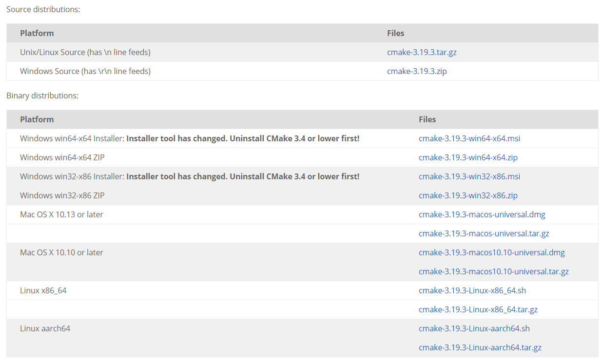

# CMake 安装

[toc]

## CMake 是什么

CMake是一个跨平台的安装（编译）工具，可以用简单的语句来描述所有平台的安装(编译过程)。他能够输出各种各样的makefile或者project文件，能测试编译器所支持的C++特性，类似UNIX下的automake。只是 CMake 的组态档取名为 CMakeLists.txt。

Cmake 并不直接建构出最终的软件，而是产生标准的建构档（如 Unix 的 Makefile 或 Windows Visual C++ 的 projects/workspaces），然后再依一般的建构方式使用。这使得熟悉某个集成开发环境（IDE）的开发者可以用标准的方式建构他的软件，这种可以使用各平台的原生建构系统的能力是 CMake 和 SCons 等其他类似系统的区别之处。


## 为什么使用 CMake

跨平台、语法比 makefile 简洁，且现在大量 C++ 开源项目使用 CMake 构建，KDE 项目也是使用 CMake 构建


## CMake安装

Linux发行版可直接使用包管理器下载，如 Ubuntu 可直接使用 `apt install cmake` 下载安装


### 下载

<https://cmake.org/download/>



CMake 官网提供了源码和二进制包


### 二进制压缩包安装

下载下来的压缩包解压到安装目录

将 bin 目录添加到环境变量


### 源码安装

解压并在目录内打开命令行窗口，依次执行

```bash
./bootstrap
make
sudo make install
```

cmake 会默认安装在 /usr/local/bin 下面
要改变安装路径，在bootstrap命令中加入'--prefix=PATH'选项。


### 验证安装是否成功

打开命令行窗口，输入 `cmake --version`

输出 cmake version x.x.x 即表示安装成功


## 实例

### CMake版Hello World

**源文件**

CMakeLists.txt

```cmake
cmake_minimum_required(VERSION 3.17)

project(Hello)

set(CMAKE_CXX_STANDARD 11)

add_executable(Hello main.cpp)
```

main.cpp

```c++
#include <iostream>

int main()
{
    std::cout << "Hello, World!" << std::endl;
    return 0;
}
```

**编译运行**

```bash
cmake .
make
./Hello
```

