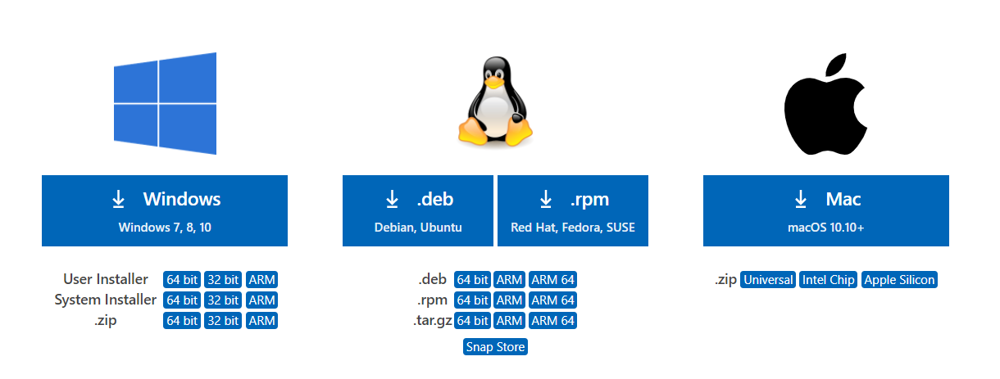
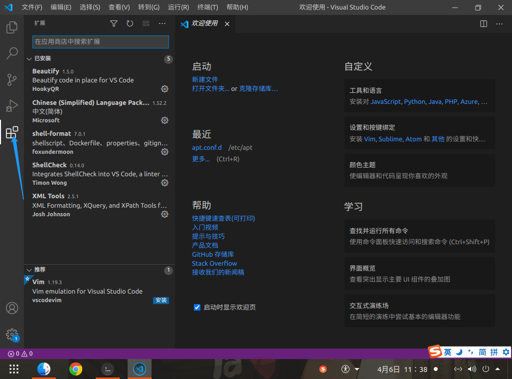
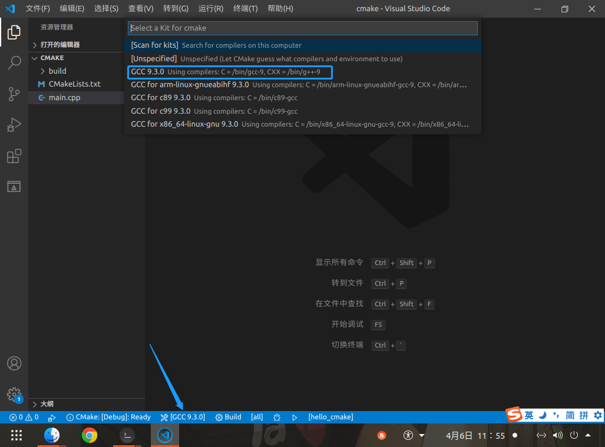
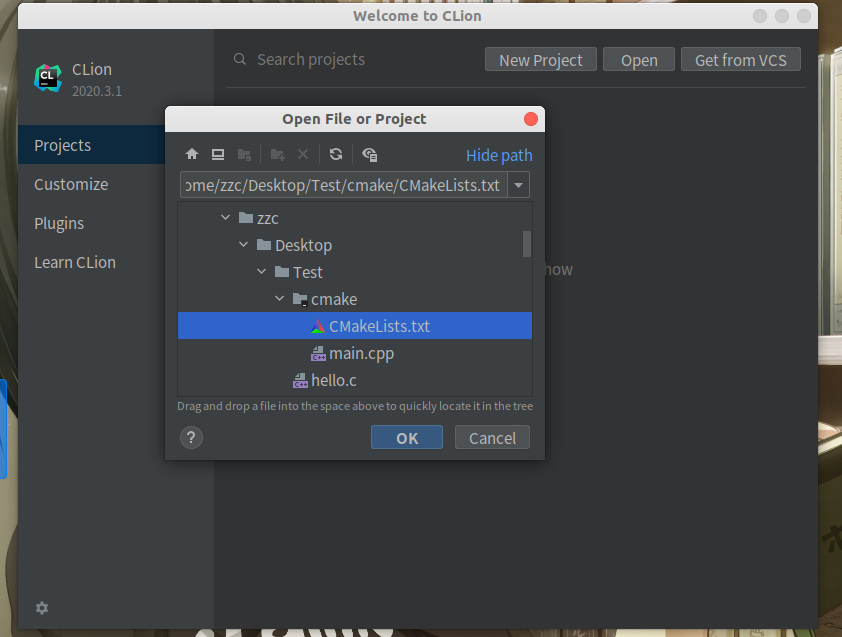

# Linux C/C++ 开发环境搭建

[toc]

## 引言

Windows 下 C/C++ 开发可以直接用宇宙第一 IDE Visual Studio；但是 Linux 下就不能用了

以 Ubuntu 为例搭建 Linux C/C++ 开发环境


## 编译调试工具

**编译器**

```bash
sudo apt update
sudo apt install gcc g++
```

**调试器**

```bash
sudo apt install gdb
```

**走两步**

来个经典的 HelloWorld

C 版本

```c
#include<stdio.h>
int main()
{
   printf("Hello World From C!\n");
   return 0;
}
```

编译运行

```bash
gcc hello.c -o hello_c
./hello_c
```

C++ 版本

```cpp
#include<iostream>
int main()
{
    std::cout << "Hello World From CXX" << std::endl;
    return 0;
}
```

编译运行

```bash
g++ hello.cpp -o hello_cpp
./hello_cpp
```


## 项目构建工具

```bash
sudo apt install make cmake
```

**Make**

make 是一个构建工具，它解释 Makefile 中的规则。在 Makefile 文件中描述了整个工程所有文件的编译顺序、编译规则。

Makefile 有自己的书写格式、关键字、函数。而且在 Makefile 中可以使用系统 shell 提供的任何命令来完成想要的工作。但是 Makefile  的编写难度较高。

**CMake**

CMake是一个跨平台的构建工具，可以用简单的语句来描述所有平台的安装、编译过程。他能够输出各种各样的 Makefile  或者 project 文件，能测试编译器所支持的 C++ 特性。CMake 的组态档取名为 CMakeLists.txt

Cmake 并不直接构建出最终的软件，而是产生标准的构建档（如 Unix 的 Makefile 或 Windows Visual C++ 的 projects/workspaces），然后再依一般的构建方式使用。这使得熟悉某个集成开发环境（IDE）的开发者可以用标准的方式建构他的软件，这种可以使用各平台的原生建构系统的能力是 CMake 和其他类似系统的区别之处。

CMake 可以脱离 IDE 构建项目，目前大部分常用的 IDE 直接支持 CMake

**CMake介绍和简单使用**

[《CMake 安装》](../CMake/001_CMake安装.md)

[《CMake 管理多项目》](../CMake/002_CMake管理多项目.md)


## 集成开发环境（IDE）

Linux 下常用的 C/C++ IDE 还是比较多的；我这里主要介绍一下 qtcreator、vscode、clion；强烈推荐使用 CLion

### Qt Creator

本文介绍单独安装

与 Qt 一起安装请参考[《Linux 安装 QT》](../QT/001_Linux安装QT.md)

**下载**

<https://download.qt.io/archive/qtcreator/>


选择所需的版本下载即可；这里下载的是qt-creator-opensource-linux-x86_64-4.4.1.run

**安装**

```bash
chmod +x qt-creator-opensource-linux-x86_64-4.4.1.run
./qt-creator-opensource-linux-x86_64-4.4.1.run
```

一直下一步就行


**导入之前的CMake项目**

文件 -> 打开文件或项目 -> 选择 CMakeLists.txt


然后就可以编译运行了

### Visual Studio Code

**下载**

<https://code.visualstudio.com/#alt-downloads>



Ubuntu 当然是下载 deb

**安装**

安装 vs code

```bash
sudo dpkg -i code_1.52.1-1608136922_amd64.deb
```

安装插件

* Chinese
* CMake
* CMake Tools
* C/C++




**导入之前的CMake项目**

文件 -> 打开文件夹 -> 选择 CMakeLists.txt 所在文件夹

如下图，点击状态栏 Kit，选择合适的编译工具



### CLion

**下载**

<https://www.jetbrains.com/clion/download/#section=linux>

**安装**

直接解压到需要安装的路径即可

请支持正版 http://www.520xiazai.com/soft/jetbrains-2020-pojie.html

创建桌面快捷方式；注意将 ```${clion_install_path}``` 替换为自己实际安装路径

jetbrains-clion.desktop

```bash
[Desktop Entry]
Name=CLion
Exec=${clion_install_path}/bin/clion.sh %f
Icon=${clion_install_path}/bin/clion.svg
Type=Application
```


**导入之前的CMake项目**

open -> 选择 CMakeLists.txt -> OK -> Open As Project




***
*由于个人水平有限，文中若有不合理或不正确的地方欢迎指出改正*

*文章可能更新不及时，请以[个人博客](https://zcteo.top/)处文章为准*

