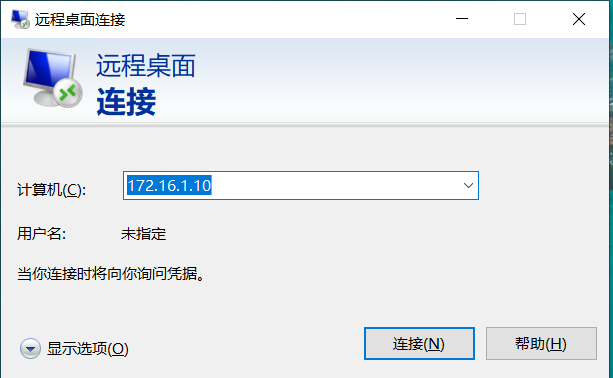
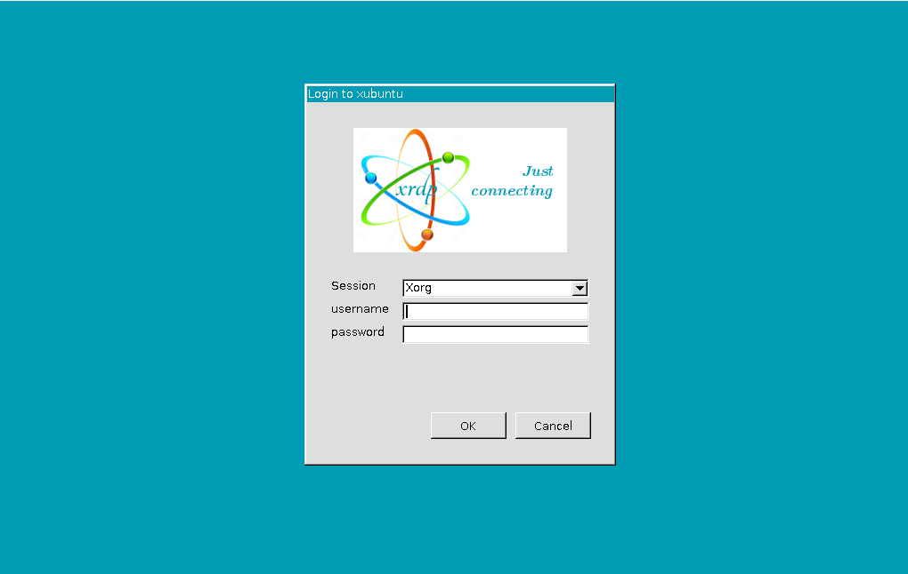
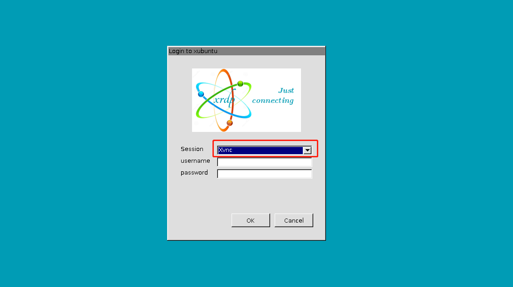

# Windows 直接远程 Linux 桌面

[toc]

## 引言

Windows 的 mstsc 是使用 RDP(Remote Desktop Protocol) 远程桌面协议的，而大部分 Linux 提供的远程桌面基本都是 VNC(Virtual Network Console) 虚拟网络控制台的，所以想要 Windows 直接访问 Linux 远程桌面的话是需要一些配置的。

桌面登录和远程登录不能同时登录，比如本地以及登录桌面了，那远程登录就会有问题或者闪退，反之亦然。


## 安装 xrdp

本文假设已经有 Linux 桌面环境了

```bash
sudo apt install xrdp
```

注销登录，退出到登录界面


## Windows 连接

使用 `win+r` 打开运行窗口，输入 mstsc 回车，打开远程桌面窗口



输入 Linux 主机的 ip 地址，点击连接，出现以下界面



登录 session 选择 xorg，输入 Linux 系统的用户名和密码点击 OK，可以看到成功进入桌面了，这时候看到的桌面背景可能和实际的不太一样


记得用完了要注销登录，而不是直接关闭远程窗口


## XRDP 使用 VNC 支持多个远程

上面的session 使用 xorg 只能支持一处登录，其他地方再登录的话会把上一个挤下来，类似 Windows 远程 Windows 的现象，XRDP 配合 VNC 的话，可以支持多处登录，然后所有客户端实时共享屏幕。

### 安装 vncserver

```bash
sudo apt install vnc4server
```

如果提示无法安装，那就安装下面这个

```bash
sudo apt install tigervnc-standalone-server
```

### Windows 连接登录

之前步骤和上面一样



登录 session 选择 xorg，输入 Linux 系统的用户名和密码点击 OK，可以看到成功进入桌面了，这时候看到的桌面背景就和实际的一样了


然后这个还支持多个客户端同时登录，使用完毕也需要手动注销登录，不然窗口管理器那边登不上。