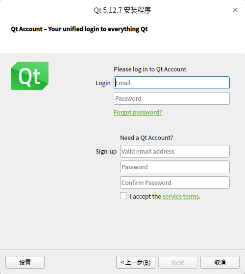
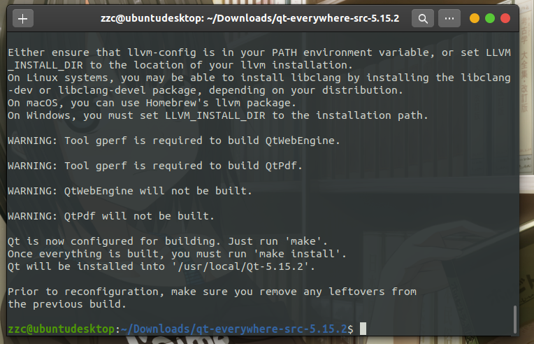

# Linux 安装/编译 QT

[TOC]

## 离线安装版

离线安装没有 Arm 架构的，且 5.15 版本开始就不提供离线安装包了

### 下载

#### Qt 官方下载

地址：<http://download.qt.io/>

*可能会打不开且下载巨慢，不详细阐述*


#### 国内镜像站下载

国内著名的几个 Qt 镜像网站

- 中国科学技术大学：<http://mirrors.ustc.edu.cn/qtproject/>
- 清华大学：<https://mirrors.tuna.tsinghua.edu.cn/qt/>
- 北京理工大学：<http://mirror.bit.edu.cn/qtproject/>
- 中国互联网络信息中心：<https://mirrors.cnnic.cn/qt/>

**我们以中科大镜像站为例**

打开链接可以看到


目录说明

| 目录                 | 说明                                                      |
| -------------------- | --------------------------------------------------------- |
| archive              | 各版本Qt 开发工具安装包，（可以下载 Qt 开发环境和源代码） |
| community_releases   | 社区定制的 Qt 库，Tizen 版 Qt 以及 Qt 附加源码包          |
| development_releases | 开发版，在 Qt 开发过程中的非正式版本                      |
| learning             | Qt 的文档教程和示范视频                                   |
| ministro             | Android 版本。                                            |
| official_releases    | 正式发布版，长期支持版（可以下载Qt开发环境和源代码）。    |
| online               | Qt 在线安装包                                             |
| snapshots            | 预览版，最新的开发测试中的 Qt 库和开发工具                |

我们选择下载长期支持版 5.12.7 (qt-opensource-linux-x64-5.12.7.run)


### 安装

给安装包赋予运行权限

```bash
chmod +x qt-opensource-linux-x64-5.12.7.run
```

运行

```bash
./qt-opensource-linux-x64-5.12.7.run
```

安装主界面


点击下一步输入账号密码登录；如果没有可以直接在下面注册



一直下一步，选择安装路径


下一步选择组件，一般不安装 Android 和源码


#### 安装后配置

安装完成，修改default.conf，执行

```bash
sudo vim /usr/lib/x86_64-linux-gnu/qt-default/qtchooser/default.conf
```

将第一行改为自己安装路径下的 bin 目录的路径，第二行改为 Qt 目录的路径，下面是我的配置

```bash
/opt/app/Qt5.12.7/5.12.7/gcc_64/bin
/opt/app/Qt5.12.7
```


## 源码编译安装

Qt5.15之后不提供离线安装包了，只提供在线安装；但是某些情况下我们并没有相应的网络环境适合在线安装，或者我们使用的处理器架构没有预编译的二进制文件，这时候就不得不学习离线安装了；这里以长期支持版5.12.10为例

你要问我为什么不交叉编译？我只想说，我不会，等我交叉编译环境配置好的话，我的开发板可能已经编译完了。

### 下载源码

具体下载地址和层级说明参考[离线安装版 -> 下载](#下载)

按照如图所示地址选择并下载 qt-everywhere-src-\*.\*.\*.tar.xz


### 编译安装

一般开源代码编译安装都是相同的流程：**config, make, make install**

**config**

指定 install 的路径；不编译测试和示例，这些东西有用，但是可以等待需要的时候再编译；~~webengine 太难编了，反正目前用不到，等以后有机会再编~~；是的，现在我不得不编 webengine 了，请参考[《编译 QtWebEngine》](006_CompileQtWebEngine.md)

```bash
./configure -prefix /opt/qt-5.12.10 -qt-xcb -fontconfig -system-freetype\
  -opensource -confirm-license -nomake tests -nomake examples -skip webengine
```

在桌面系统，上面的 `-qt-xcb -fontconfig -system-freetype` 选项一定要加，第一个不加 UI 程序起不来，后面两个不加就不显示字体

 `-fontconfig` 不能和  `-qt-freetype` 搭配，会出现以下报错 ，大概意思就是要用 `-system-freetype`

> ERROR: Feature 'fontconfig' was enabled, but the pre-condition '!config.msvc && features.system-freetype && libs.fontconfig' failed.

~~config 的过程中会让选开源版还是商业版，然后还有一个同意开源协议~~，加上 `-opensource -confirm-license` 就不用手动选择和确认了；漫长的等待后就会看到以下结果：虽说程序员从不关心 warning，但有些时候还是可以注意一下下，根据提示安装缺少的依赖

```bash
# 这是QT官网推荐的
sudo apt install libfontconfig1-dev libfreetype6-dev\
     libx11-dev libxext-dev libxfixes-dev libxi-dev\
     libxrender-dev libxcb1-dev libx11-xcb-dev\
     libxcb-glx0-dev libxkbcommon-x11-dev

# 这是我在ubuntu 20.04上面根据警告和错误日志额外安装的
sudo apt install build-essential mesa-common-dev libdbus-1-dev

# 这俩是qtdoc的，要编译文档才装，因为这比较大
sudo apt install libclang-dev llvm
```



**make**

```bash
make -j$(nproc)
```

这个就是更漫长的等待了；在 FT2000/4 上面耗时 95min 左右

**make install**

```bash
sudo make install
```


### 编译文档

文档需要单独编译，然后就可以 `F1` 跳转了

```bash
make docs -j$(nproc)
sudo make install
```

在 FT2000/4 上面耗时 57min 左右


### 编译过程中可能遇到的问题

**internal compiler error: Killed (program cc1plus)**

内存不够了，加虚拟内存，请参考[《Linux 创建交换文件 swapfile》](../Linux/012_LinuxCreateSwapfile.md)


## 第一次使用可能出现的问题

**Failed to find "GL/gl.h" in "/usr/include/libdrm"**

如果是自己编译的不会有这个问题，因为之前装过了

```bash
sudo apt install mesa-common-dev -y
```

**Qt Creator 启动失败**

```bash
sudo apt install libxcb-xinerama0
```


## 参考文档

1. [QtDoc - Building Qt Sources](https://doc.qt.io/qt-5/build-sources.html)

